# Docker-Compose Provider Design

## Overview

This document describes the design for adding docker-compose as a first-class provider in boxman, enabling mixed topologies where libvirt VMs and docker containers coexist in the same project with L2 connectivity via shared bridges.

## Table of Contents

1. [Architecture Overview](#architecture-overview)
2. [Provider Dispatch Model](#provider-dispatch-model)
3. [Configuration Schema v2.0](#configuration-schema-v20)
4. [Network Integration](#network-integration)
5. [Volume Management](#volume-management)
6. [Implementation Phases](#implementation-phases)
7. [Breaking Changes & Versioning](#breaking-changes--versioning)
8. [Decisions (Phase 0)](#decisions-phase-0)

---

## Architecture Overview

### Top-Down Architecture

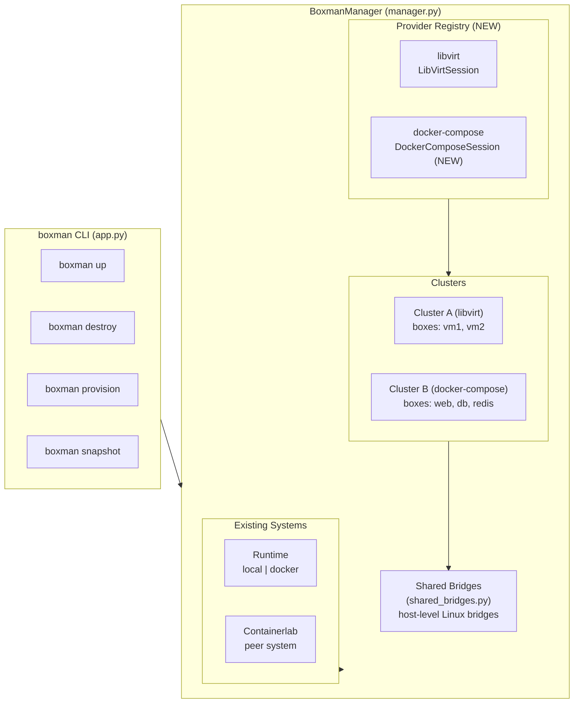

### Component Interaction

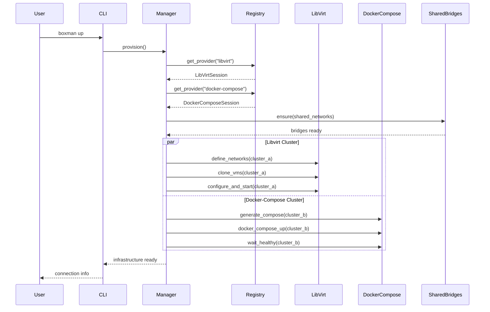

---

## Provider Dispatch Model

### Current Model (Single Provider)

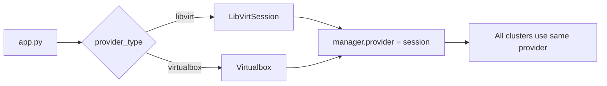

### Proposed Model (Per-Cluster Provider)

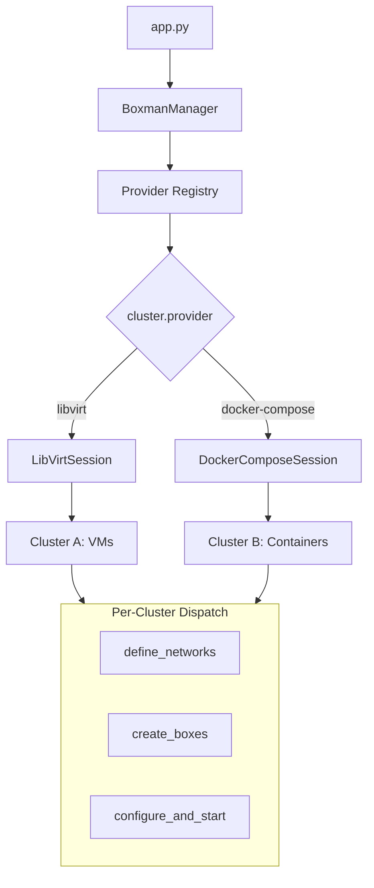

### Provider Protocol Extension

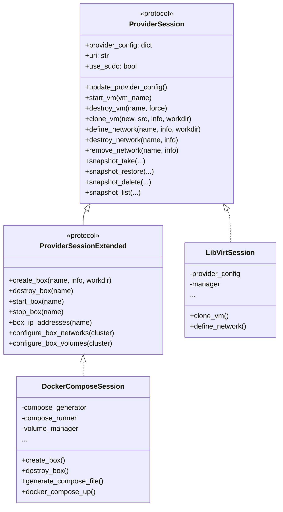

---

## Configuration Schema v2.0

### Version Detection

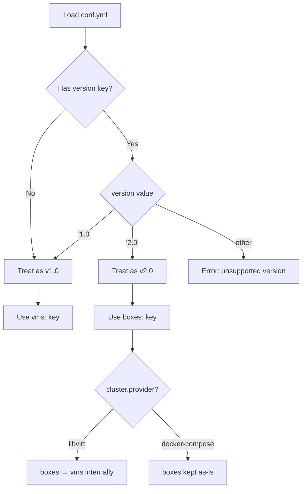

### v2.0 Config Structure

```yaml
version: '2.0'
project: my_hybrid_lab

provider:
  libvirt:
    uri: qemu:///system
    use_sudo: false
  docker-compose:
    project_name: my_hybrid_lab

shared_networks:
  app_bridge:
    bridge: br-app
    stp: false
    disable_netfilter: false   # default — scoped per-bridge rules instead (decision D8)

clusters:
  compute:
    provider: libvirt
    workdir: ~/workspaces/my_lab/compute
    base_image: ubuntu-24.04-cloudinit
    networks:
      mgmt:
        mode: nat
        network: 192.168.10.0/24
    boxes:
      node01:
        hostname: node01
        cpus: { sockets: 1, cores: 2 }
        memory: 2048
        network_adapters:
          - name: eth0
            network_source: mgmt
          - name: eth1
            network_source: app_bridge

  services:
    provider: docker-compose
    workdir: ~/workspaces/my_lab/services
    networks:
      backend:
        driver: bridge
        subnet: 172.20.0.0/24
    boxes:
      web:
        image: nginx:latest
        ports:
          - "8080:80"
        networks:
          - backend
          - app_bridge
        depends_on:
          - api
      api:
        image: myapp/api:latest
        networks:
          - backend
      db:
        image: postgres:16
        volumes:
          - name: pg_data
            container_path: /var/lib/postgresql/data
            size: 10G
        networks:
          - backend
```

### Migration Path

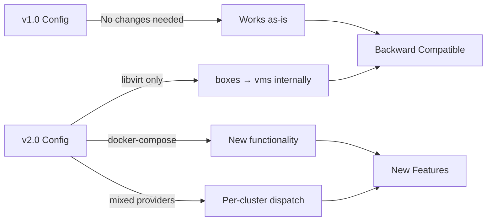

---

## Network Integration

### L2 Connectivity via Shared Bridges

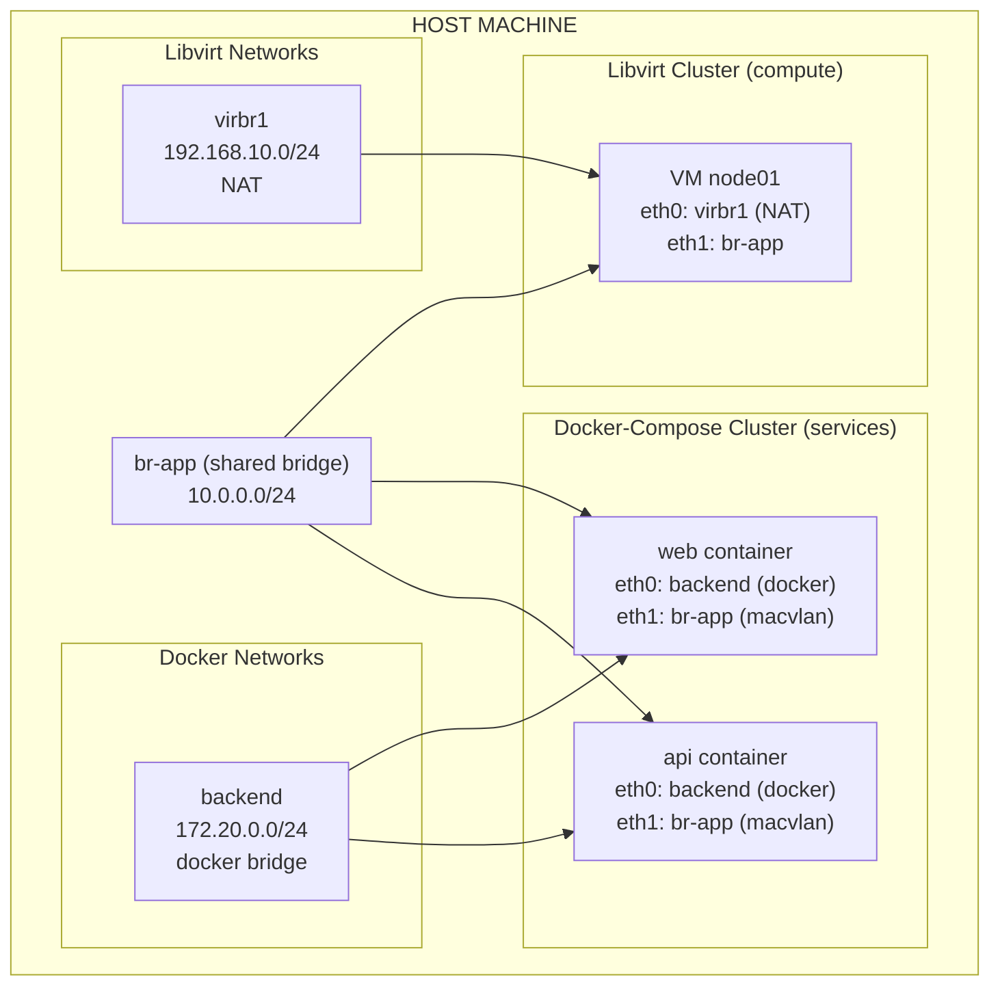

### Macvlan Configuration

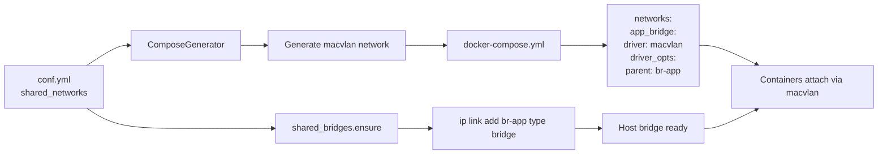

### Network Isolation Model

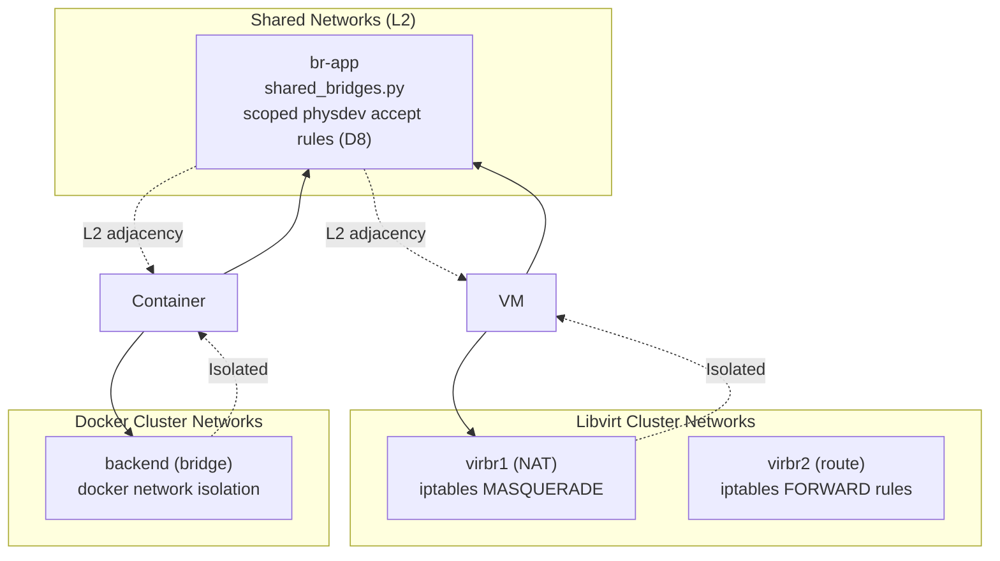

### Netfilter Policy (decision D8)

`shared_bridges.ensure()` keeps the host-global `bridge-nf-call-iptables`
**untouched** by default. Lab frames on a shared bridge are allowed by an
idempotent per-bridge rule instead:

```
iptables -I FORWARD 1 -i <bridge> -o <bridge> -m physdev --physdev-is-bridged -j ACCEPT
```

(`FORWARD` is the default — it works without docker; the `DOCKER-USER` chain
is a spike-validated alternative on docker hosts and survives docker
restarts). Rationale: the previous global `bridge-nf-call-iptables=0` weakens
docker/k8s bridge filtering host-wide, is never restored, and silently
reverts on any reboot (the `br_netfilter` module defaults the sysctl to 1 on
load) or on kubernetes hosts (kubelet enforces `=1`) — breaking the lab.
Spike note: modern docker (29.x) itself does *not* reset it on daemon
restart. `disable_netfilter: true` remains available as an explicit opt-in
with a loud warning. Evidence: [spike/findings.md](spike/findings.md)
(executed 2026-07-13, all scenarios pass); implementation: Phase 4
([#52](https://github.com/mherkazandjian/boxman/issues/52)).

---

## Volume Management

### Volume Types

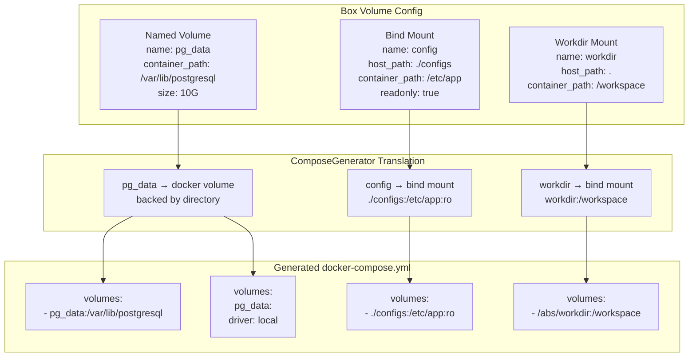

### Volume Lifecycle

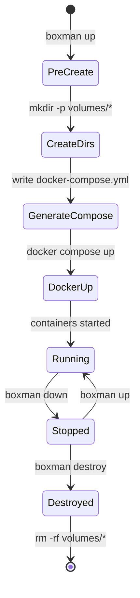

---

## Implementation Phases

### Phase Overview

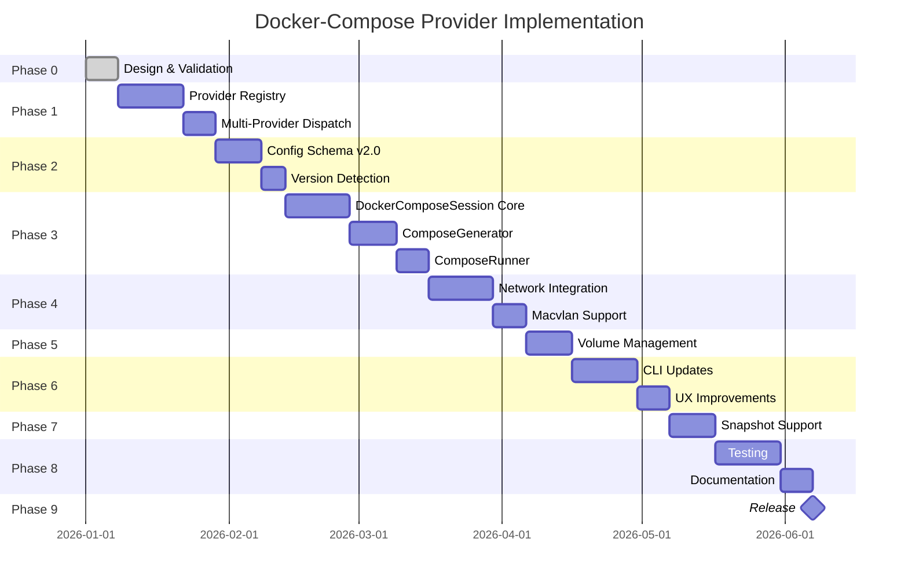

### Phase Dependencies

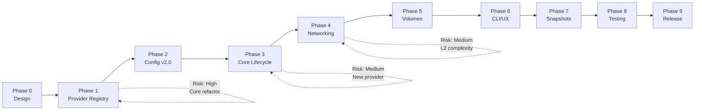

### Acceptance Criteria per Phase

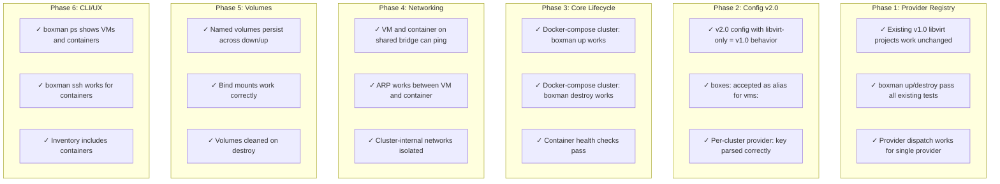

---

## Breaking Changes & Versioning

### Compatibility Matrix

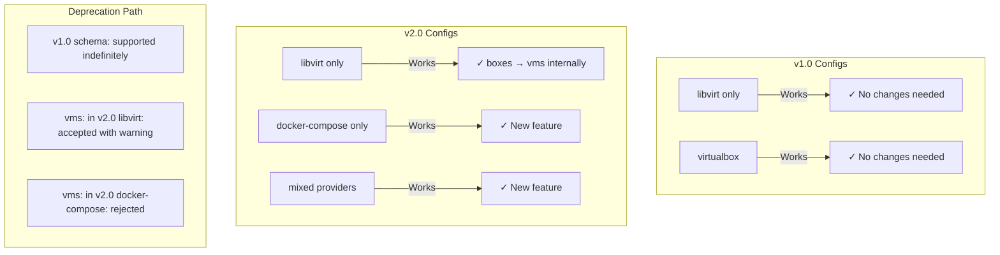

### Version Detection Logic

```python
def load_config(path):
    config = yaml.safe_load(rendered)
    version = config.get('version', '1.0')
    
    if version == '1.0':
        return config  # no transformation
    elif version == '2.0':
        return normalize_v2_config(config)
    else:
        raise ConfigError(f"unsupported version: {version}")

def normalize_v2_config(config):
    """Convert v2.0 to internal format."""
    for cluster_name, cluster in config['clusters'].items():
        provider = cluster.get('provider', 'libvirt')
        
        if provider == 'libvirt':
            # boxes → vms for libvirt code path
            if 'boxes' in cluster:
                cluster['vms'] = cluster.pop('boxes')
        elif provider == 'docker-compose':
            # boxes kept as-is for docker-compose code path
            pass
    
    return config
```

---

## Decisions (Phase 0)

Ratified on [#48](https://github.com/mherkazandjian/boxman/issues/48). See also
[adr-001-per-cluster-provider.md](adr-001-per-cluster-provider.md) and
[spike/findings.md](spike/findings.md). These supersede the former "Open
Questions" section.

| # | Question | Decision |
|---|---|---|
| D1 | Container readiness | `docker compose up --wait` + per-cluster `readiness_timeout` (default 120s): waits for `healthy` when a healthcheck exists, `running` otherwise — no custom polling loop. |
| D2 | Container access | `boxman ssh <cluster>.<box>` transparently uses `docker exec -it` — no sshd sidecars. Ansible reaches containers via the `community.docker` connection plugin. `write_ssh_config` stays VM-only. |
| D3 | Snapshot semantics | `docker commit`-backed: `take` commits + tags `boxman/<project>_<box>:<snap>`; `restore` regenerates the compose file with snapshot tags + `up --force-recreate`; `list`/`delete` = image ls/rmi + metadata JSON in the cluster workdir. **Volumes are not snapshotted** — documented loudly. |
| D4 | `build.context` | Resolved by boxman to an absolute path (relative to the conf.yml directory) at generation time — the generated compose file lives in the cluster workdir, so passing relative paths through would silently break. |
| D5 | Compose file location | `<cluster_workdir>/docker-compose.yml` — inspectable and hand-runnable (`docker compose -f … ps`), same debuggability philosophy as the `.rendered.yml` dump. |
| D6 | Provider granularity | Per-cluster only; per-box rejected ([ADR-001](adr-001-per-cluster-provider.md)). A box of another provider is a one-box cluster. |
| D7 | Compose passthrough | `compose_extra:` escape hatch (per-box and per-cluster), deep-merged verbatim into the generated file — keeps the boxman dialect small without blocking on unsupported compose features. |
| D8 | Netfilter | Shared bridges keep host-global `bridge-nf-call-iptables` untouched by default (`disable_netfilter` defaults to `false`); per-bridge scoped physdev accept rules allow lab frames. Global disable = explicit opt-in with loud warning. See [Netfilter Policy](#netfilter-policy-decision-d8). Implemented in Phase 4 ([#52](https://github.com/mherkazandjian/boxman/issues/52)). |

---

## Next Steps

1. Run the netfilter spike ([spike/poc.sh](spike/poc.sh)) on a docker lab host and record [spike/findings.md](spike/findings.md)
2. Merge this design (PR → `main`), closing Phase 0 ([#48](https://github.com/mherkazandjian/boxman/issues/48))
3. Begin Phase 1 — provider registry ([#49](https://github.com/mherkazandjian/boxman/issues/49)); full phase map in [implementation-plan.md](implementation-plan.md)
