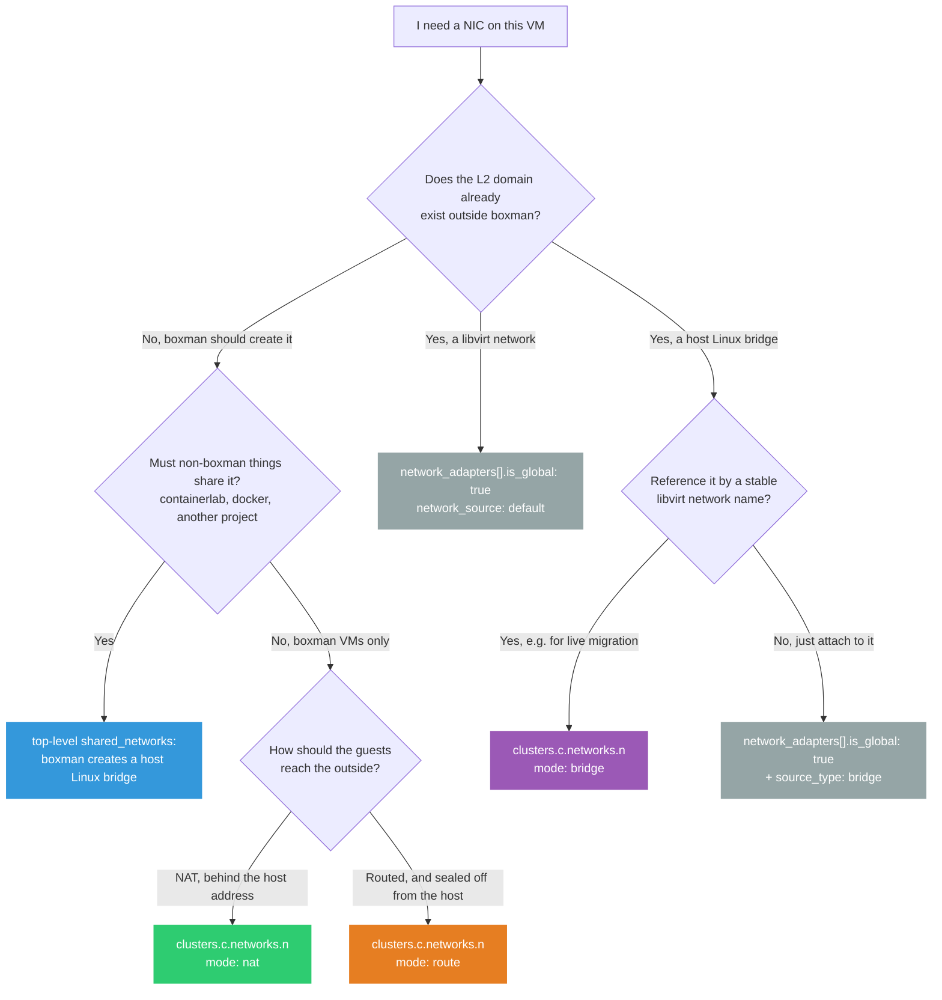
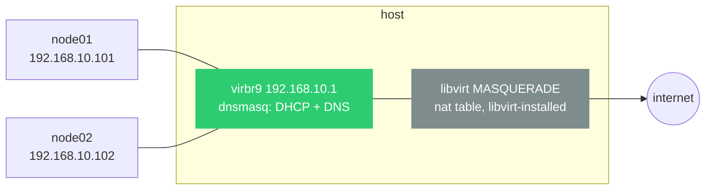
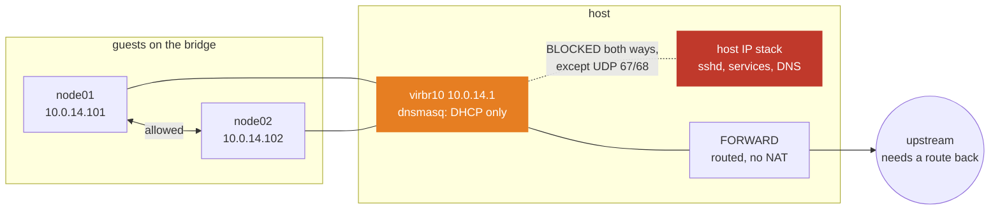
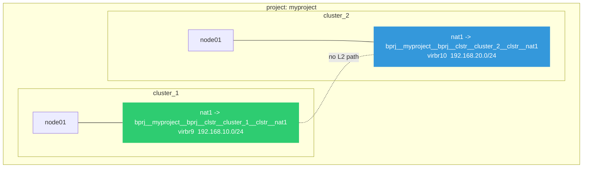
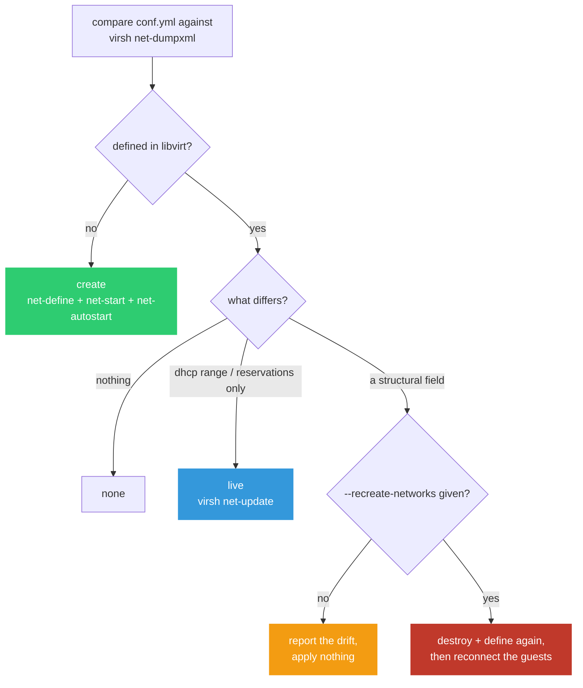
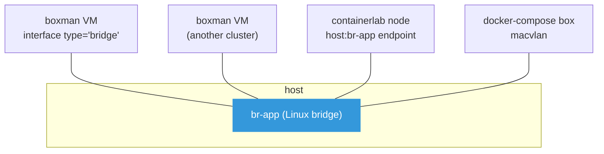

# Networking

How boxman attaches VMs to networks, what each mode does, and what boxman
configures on the host beyond what libvirt does by itself.

- [Choosing an attachment](#choosing-an-attachment)
- [Per-cluster networks](#per-cluster-networks)
  - [`mode: nat`](#mode-nat)
  - [`mode: route`](#mode-route)
  - [`mode: bridge`](#mode-bridge)
- [Namespacing: why two clusters never collide](#namespacing-why-two-clusters-never-collide)
- [The routed-network isolation contract](#the-routed-network-isolation-contract)
- [Reconciliation: changing a network after it exists](#reconciliation-changing-a-network-after-it-exists)
- [`shared_networks`: host bridges for hybrid labs](#shared_networks-host-bridges-for-hybrid-labs)
- [`is_global`: attaching to a network boxman does not own](#is_global-attaching-to-a-network-boxman-does-not-own)
- [Troubleshooting](#troubleshooting)
- [Where the code lives](#where-the-code-lives)

## Choosing an attachment

There are five ways to get a NIC into a VM, and picking the wrong one is the
single most common networking mistake with boxman. What separates them is who
owns what:

- **`nat`, `route` and `bridge`** are all boxman-owned libvirt networks,
  declared per cluster, defined on provision and removed on destroy. They differ
  in what sits *underneath*: for `nat` and `route` libvirt creates the Linux
  bridge and deletes it again, while `bridge` wraps a host bridge that boxman
  never creates, touches or removes.
- **`shared_networks`** is a host Linux bridge that boxman creates but never
  destroys.
- **`is_global`** is a bare reference to something boxman does not manage at
  all.



At a glance:

| Attachment | Declared under | boxman creates it | `boxman destroy` removes it | Namespaced per cluster | Guest reaches host |
|---|---|---|---|---|---|
| `mode: nat` | `clusters.<c>.networks` | yes | yes | yes | yes |
| `mode: route` | `clusters.<c>.networks` | yes | yes | yes | **no** (DHCP only) |
| `mode: bridge` | `clusters.<c>.networks` | the libvirt network only | the libvirt network only | yes | depends on the bridge |
| `shared_networks` | top level | yes (the Linux bridge) | **no** | no | depends on the bridge |
| `is_global: true` | on the adapter | no | no | no | depends |

## Per-cluster networks

A network declared under `clusters.<cluster>.networks.<name>` is a libvirt
network that boxman defines, starts, autostarts and — on `boxman destroy` —
removes. `mode:` accepts exactly three values; anything else is rejected at
validation time with `unsupported forward mode`.

```yaml
clusters:
  cluster_1:
    networks:
      nat1:
        mode: nat
        bridge: { name: virbr9, stp: 'on', delay: '0' }   # name optional
        mac: '52:54:00:0c:00:01'
        ip:
          address: '192.168.10.1'
          netmask: '255.255.255.0'
          dhcp:
            range: { start: '192.168.10.2', end: '192.168.10.99' }
            hosts:
              - { mac: '52:54:00:0c:01:01', ip: '192.168.10.101', name: node01 }
    vms:
      node01:
        network_adapters:
          - { name: adapter_1, network_source: nat1, link_state: 'up' }
```

If `bridge.name` is omitted, boxman picks the first free `virbrX`.

Static reservations are validated up front, because libvirt accepts several
spellings that then define cleanly and hand out an address that cannot work.
Each reservation must carry both a `mac` and an `ip`; the address must be inside
the network and must not be the gateway, the network address or the broadcast
address; and no `mac`, `ip` or `name` may repeat. A reservation *inside* the
DHCP range is fine — dnsmasq excludes a reserved address from dynamic
allocation. The optional `name` becomes the dnsmasq hostname, so the guest also
resolves by name on that network.

### `mode: nat`

libvirt creates the bridge, runs dnsmasq on it, and installs its own masquerade
and `FORWARD` rules when the network starts. **boxman adds nothing** — no
iptables rules of its own. Guests reach the internet through the host's
address, reach the host, and reach each other.



Use it for anything that just needs to work: guests pull packages, you SSH in
from the host, and nothing outside the host can reach them unsolicited.

### `mode: route`

libvirt forwards the guest subnet **without** NAT, so guest addresses appear on
the wire as themselves. That makes the subnet reachable from elsewhere only if
your upstream router has a route back to it — nothing on the host arranges
that for you.

On top of libvirt's forwarding, boxman applies an **isolation contract**: the
host and the guests may not talk to each other at all, while guests on the same
bridge talk freely. This is the mode's main reason to exist in boxman, and it is
described in full in [its own section](#the-routed-network-isolation-contract).



Consequences worth knowing before you choose this mode:

- **No DNS from the host.** libvirt's dnsmasq serves DNS on the bridge address,
  which the isolation makes unreachable. Guests need an externally reachable
  resolver. boxman actively stops dnsmasq from advertising the unusable one
  (see below).
- **No SSH from the host to the guest**, so `boxman ssh` cannot reach a VM
  whose only NIC is on a routed network. Give such a VM a second adapter on a
  `nat` network if you want management access.
- **A default route is not handed out**, so a guest with only this NIC has no
  gateway unless you configure one.

### `mode: bridge`

Points a libvirt network at an **already existing** host Linux bridge. boxman
defines and removes the libvirt network; it never creates or deletes the bridge
underneath, and installs no firewall rules.

```yaml
networks:
  migration:
    mode: bridge
    bridge:
      name: br-migration     # must already exist and be administratively up
vms:
  node01:
    network_adapters:
      - { name: adapter_1, network_source: migration }
```

The block is deliberately narrow: `ip`, `mac`, `bridge.stp` and `bridge.delay`
are **rejected**, because addressing and link policy belong to the host bridge,
not to a network that merely references it.

For a libvirt URI with no authority (`qemu:///system`, a local unix socket),
boxman probes `/sys/class/net/<bridge>/bridge` and the interface's `IFF_UP` flag
before defining anything. `operstate` is deliberately not consulted: an up
bridge with no attached ports commonly reports `unknown`. For any
authority-bearing URI — including `qemu://localhost/system` and
`qemu+ssh://hv/system` — the client's `/sys` is not authoritative, so the check
is skipped and the endpoint's own libvirt daemon validates the bridge at
`net-start`.

Use it when several hypervisors should map one stable network name onto their
own local bridge, which is what live migration wants. Use `shared_networks`
instead when you want boxman to *create* the bridge on this host.

> **Ownership warning.** Moving a network between `nat`/`route` and `bridge`
> crosses bridge ownership: libvirt deletes a bridge it manages, and preserves
> one it does not. Use different bridge names across that transition, or omit
> the managed side's `bridge.name` so boxman reserves a fresh automatic one.

## Namespacing: why two clusters never collide

A per-cluster network's libvirt name is built from the project and cluster:

```
bprj__<project>__bprj__clstr__<cluster>__clstr__<network>
```

So `nat1` in `cluster_1` and `nat1` in `cluster_2` are two different libvirt
networks, with their own bridges, address ranges and DHCP scopes — even inside
one `conf.yml`, and certainly across projects. They are isolated at L2 and
cannot see each other's traffic.



This is why "my two clusters can talk to each other" is almost always a
misdiagnosis. If you *want* them to, give both a `shared_networks` bridge.

Adapter `network_source` is resolved in this order:

1. names a top-level `shared_networks` key → rewritten to that host bridge, and
   `source_type: bridge` is set for you;
2. otherwise `is_global: true` → left exactly as written;
3. otherwise → namespaced with the rule above.

Writing `source_type: bridge` by hand without `is_global: true` does not work:
step 3 still namespaces the value and the attach fails on a bridge that does not
exist. Prefer `shared_networks:`, which sets both correctly.

## The routed-network isolation contract

Only `mode: route` gets this. `nat` and `bridge` networks are untouched.

**The contract:** guests on the bridge may talk to each other; the host and the
guests may not talk at all — except DHCP, and only when the network declares a
`dhcp:` block of its own.

The DHCP exception is not a convenience. libvirt runs dnsmasq **on the host**,
bound to the bridge address, so DHCP terminates on the host and travels `INPUT`
and `OUTPUT` — exactly the chains being blocked. Without a hole, a routed
network could never hand out the addresses it advertises.

### The rules boxman installs

Two chains per bridge, one per direction, hooked from `INPUT` and `OUTPUT`:

```text
  guest ──▶ [ INPUT  -i virbr10 ] ──▶ BXM_ISO_I_virbr10
                                        -p udp --dport 67 -j ACCEPT  ◀╮
                                        -j DROP                       │ present
                                                                      │ only if
  host  ──▶ [ OUTPUT -o virbr10 ] ──▶ BXM_ISO_O_virbr10               │ DHCP is
                                        -p udp --dport 68 -j ACCEPT  ◀╯ declared
                                        -j DROP

  guest ──▶ [ FORWARD ] -i virbr10 -o virbr10 -j ACCEPT   ◀ guest-to-guest
```

Three details that are load-bearing:

- **They live in dedicated chains, not loose in `INPUT`/`OUTPUT`.** Reconciling
  is then "flush and refill in order" rather than "insert and hope the ordering
  survived" — `iptables -I` pushes to the top, so a DROP re-inserted after an
  ACCEPT silently lands above it and re-breaks DHCP.
- **The chain prefix is short on purpose.** iptables caps a chain name at 28
  characters and an interface name may be 15, so `BXM_ISO_I_` leaves just enough
  room. Non-alphanumeric characters in the bridge name are replaced with `_`.
- **The hole is UDP 67/68 only.** DNS on port 53 stays blocked, which is why
  the DNS advertisement has to go too.

Older boxman versions wrote these rules directly into `INPUT`/`OUTPUT`. Those
are detected and deleted on every apply, so a host does not accumulate them.

### Why the DHCP offer is trimmed

Opening the firewall for DHCP is only *safe* once dnsmasq has stopped
advertising things the isolation makes unreachable. libvirt's dnsmasq hands out
the bridge address as both router (DHCP option 3) and DNS server (option 6).
Both are unreachable by construction here, and the router option is actively
harmful: it installs a default route at metric 0, which outranks the guest's
real NIC and black-holes all of its traffic.

So for a routed network with DHCP, boxman emits a dnsmasq override in the
network XML that suppresses both options — an empty `dhcp-option=N` tells
dnsmasq to omit that option entirely:

```xml
<network xmlns:dnsmasq='http://libvirt.org/schemas/network/dnsmasq/1.0'>
  ...
  <dnsmasq:options>
    <dnsmasq:option value='dhcp-option=3'/>
    <dnsmasq:option value='dhcp-option=6'/>
  </dnsmasq:options>
</network>
```

The guest gets an address and a netmask, and nothing it cannot use.

**The two halves are interlocked.** Before punching the firewall hole, boxman
reads the *live* definition with `net-dumpxml` and checks the suppression is
actually there. A network defined by an older boxman still advertises the bad
options, so opening DHCP for it would produce exactly the breakage the trimming
prevents. In that case the hole stays shut and you get:

```
network <name>: keeping DHCP blocked because the live definition still
advertises a router and DNS server that this network's isolation makes
unreachable. Reconcile plans this as a structural change, so `boxman up
--recreate-networks` will migrate it; DHCP is allowed once it has.
```

That migration path exists because `dhcp_options_trimmed` is a
[structural field](#reconciliation-changing-a-network-after-it-exists) — libvirt
cannot change dnsmasq options on a live network, and leaving them unmodelled
would have made such a network plan as "no change" and stay unmigratable
forever.

### Self-healing

Isolation rules are **host iptables state, not libvirt state**. A reboot, an
`iptables -F`, or a docker restart that rebuilds the filter table removes them,
while the libvirt network itself autostarts perfectly happily without them —
leaving a routed network that is up, working, and no longer isolated.

So the rules are re-asserted on **every** `boxman up` and `boxman update`, not
only when the network is first defined. The check is exact: the chain must be
hooked, and its contents must match the expected rule list in length, order and
body. Extras count as drift too — a broad `-j ACCEPT` above the drop would
satisfy a loose "ends with a DROP" check while isolating precisely nothing.

Per network, the outcome is one of:

| Outcome | Meaning |
|---|---|
| `skipped` | not a routed network |
| `absent` | the network is not defined; its own failure is reported elsewhere |
| `ok` | rules were already present and correct |
| `repaired` | rules were missing or wrong and have been re-applied (logged as a **warning** — the network was unprotected until now) |
| `drifted` | as `repaired`, but this was a dry run so nothing was touched |
| `failed` | the rules could not be applied |

A `failed` isolation fails the whole run. Exiting 0 while guests can still reach
the host would report containment that does not exist.

## Reconciliation: changing a network after it exists

Edit a network in `conf.yml` and the next `boxman up` or `boxman update` picks
it up — no re-provision. What happens depends on *what* changed, because libvirt
only permits some sections to be edited in place.



| Changed | Applied how | Disruptive |
|---|---|---|
| `ip.dhcp.hosts` | `virsh net-update --live --config` | no — dnsmasq reloads, the bridge stays up |
| `ip.dhcp.range` | same, as delete + add (libvirt refuses `modify` on a range) | no |
| network defined but stopped | started | no |
| network absent | defined and started | no |
| `mode`, `ip.address`, `ip.netmask`, `mac`, `bridge.name`, `bridge.stp`, `bridge.delay`, DHCP option suppression | destroy + define again | **yes**, needs `--recreate-networks` |

`bridge.name` is only compared when the config pinned one; otherwise boxman
assigned it and libvirt is authoritative.

A guest holding a lease keeps its old address until renewal, so a new
reservation takes hold at the next renewal or an `ifdown`/`ifup` in the guest.

**Why a recreate is disruptive.** libvirt answers *"can't update 'ip' section of
network"* for these fields, so the only way to apply them is to destroy the
network — which deletes the bridge and leaves every attached guest with a dead
NIC. libvirt does **not** reconnect them. With `--recreate-networks`, boxman
prompts with the affected VMs (skip with `-y`) and afterwards reconnects each
one: a hot detach/attach where the machine type supports PCI hotplug, otherwise
a graceful reboot.

Two values are normalised so they do not read as permanent drift: an unquoted
`stp: on` (YAML makes that the boolean `True`; libvirt stores `on`), and a
short-form network `mac:` like `52:54:0:a:b:c`, which libvirt zero-pads. A
reservation `mac:` is *not* padded — libvirt keeps those verbatim.

> **A reservation `name:` may not contain `&`, `<`, `>`, `"` or `'`.** libvirt
> writes the name back out unescaped internally, so such a network defines fine
> and then fails at `net-start` with `EntityRef: expecting ';'`. boxman rejects
> the name up front instead.

## `shared_networks`: host bridges for hybrid labs

A top-level `shared_networks:` entry is a plain Linux bridge on the host — not
a libvirt network, and **not namespaced**. Both sides of a hybrid topology
attach to the same bridge, so a boxman VM and an emulated switch can trade
LLDP, DHCP, 802.1Q and STP as if they were cabled into the same physical switch.

```yaml
shared_networks:
  app_bridge:
    bridge: br-app
    mtu: 9500          # containerlab veths default to 9500; bridges to 1500
    stp: false
```



`ensure()` is idempotent for a single declaration: create if missing, bring up,
apply MTU and STP. There is **no teardown** — `boxman destroy` leaves shared
bridges alone, because another project may still be using one. Removing them is
an explicit user action.

> **That "boxman will not tear it down" is the only sense in which a shared
> bridge is safe across projects.** Bridge names are global and not namespaced,
> and every run re-applies the settings to whatever bridge the name resolves to,
> so two projects that declare the same bridge differently get last-run-wins.
> Every project sharing a bridge must agree on its settings.

The re-application is not uniform, which makes the disagreement easy to miss:

| Setting | On every `ensure()` | If a project omits it |
|---|---|---|
| bridge exists, link `up` | re-applied | — |
| `mtu` | applied only when declared | the existing MTU is left alone |
| `stp` | **always applied** | forced **off** — the key defaults to `false` |
| `disable_netfilter` | acts only when `true` | the host-global sysctl is **not** restored to `1` |

So a project that simply does not mention `stp:` silently turns STP off for
everyone else on that bridge, and one project's `disable_netfilter: true`
outlives the run that set it — nothing puts `bridge-nf-call-iptables` back to
`1` except a reboot or kubelet.

By default boxman also installs a **scoped** per-bridge accept rule so bridged
lab frames survive a docker-style `FORWARD` DROP policy:

```
-i br-app -o br-app -m physdev --physdev-is-bridged -j ACCEPT
```

inserted into `FORWARD`, and into `DOCKER-USER` as well when that chain exists
— docker recreates but does not flush `DOCKER-USER`, so that copy survives a
daemon restart. Only the IPv4 table is covered; a host with a restrictive IPv6
`FORWARD` policy needs the analogous `ip6tables` rule, which boxman does not
install yet.

The alternative, `disable_netfilter: true`, sets the host-global
`bridge-nf-call-iptables=0` instead. It is a discouraged opt-in: it weakens
docker and kubernetes bridge filtering **host-wide**, and is reverted by any
reboot or by kubelet. Prefer the default.

Bridge names must match `^[a-zA-Z0-9_.-]{1,15}$` — the kernel's `IFNAMSIZ` is 16
bytes including the trailing NUL.

## `is_global`: attaching to a network boxman does not own

`is_global: true` on an adapter disables namespacing entirely, so
`network_source` is taken as a literal libvirt network name:

```yaml
network_adapters:
  - name: adapter_1
    network_source: default      # the stock libvirt network
    is_global: true
```

Add `source_type: bridge` to name a host Linux bridge instead of a libvirt
network. boxman will not create, validate or remove any of it — that is the
point of the escape hatch.

## Troubleshooting

**Guests get an address and reach the host, but nothing past it.** Docker and
libvirt are fighting over the shared `filter` table; docker leaves the `FORWARD`
policy at `DROP` and libvirt's rules are collateral damage. This is common
enough to have its own write-up with the full fix — see
[Docker and libvirt fight over the same firewall table](../README.md#docker-and-libvirt-fight-over-the-same-firewall-table)
in the main README. `python3 scripts/installer/check_prerequisites.py` detects
both the acute and the latent form.

**A routed guest has an address but no connectivity at all.** Check whether the
network was defined by an older boxman that still advertises the unreachable
gateway: `virsh net-dumpxml <name> | grep dhcp-option`. If nothing comes back,
migrate it with `boxman up --recreate-networks`.

**A routed guest cannot resolve names.** Expected: DNS on the bridge is
unreachable by design. Configure an externally reachable resolver in the guest.

**`boxman ssh` cannot reach a VM.** If its only adapter is on a `mode: route`
network, the host cannot reach it at all. Add a second adapter on a `nat`
network.

**`bridge '<name>' is already in use by another active network`.** Two networks
want the same bridge. Either pin distinct `bridge.name` values or omit them and
let boxman allocate free `virbrX` names.

**A network change appears to do nothing.** It is probably structural, and
boxman reports the drift but applies nothing without `--recreate-networks`. Run
with `-v` to see the plan lines (`network <c>/<n>: forward mode ... (needs
recreate)`).

## Where the code lives

| Concern | File |
|---|---|
| Network definition, modes, iptables isolation | `src/boxman/providers/libvirt/net.py` |
| Desired-vs-live diff and the reconcile plan (pure functions) | `src/boxman/providers/libvirt/net_reconcile.py` |
| Reconcile orchestration, isolation self-healing, failure reporting | `src/boxman/manager_parts/networks.py` |
| Name qualification and adapter resolution | `src/boxman/manager_parts/naming.py` |
| Host Linux bridges for shared L2 | `src/boxman/netlab/shared_bridges.py` |
| Network XML template | `src/boxman/assets/network.xml.j2` |
| Adapter XML template | `src/boxman/assets/network_interface.xml.j2` |

Related documents: the [tutorial](tutorial/README.md) walks a NAT network
end to end, and the docker-compose provider has its
[own networking model](docker-compose-provider/config-schema.md) (cluster
-internal docker networks plus macvlan onto a `shared_networks` bridge).
