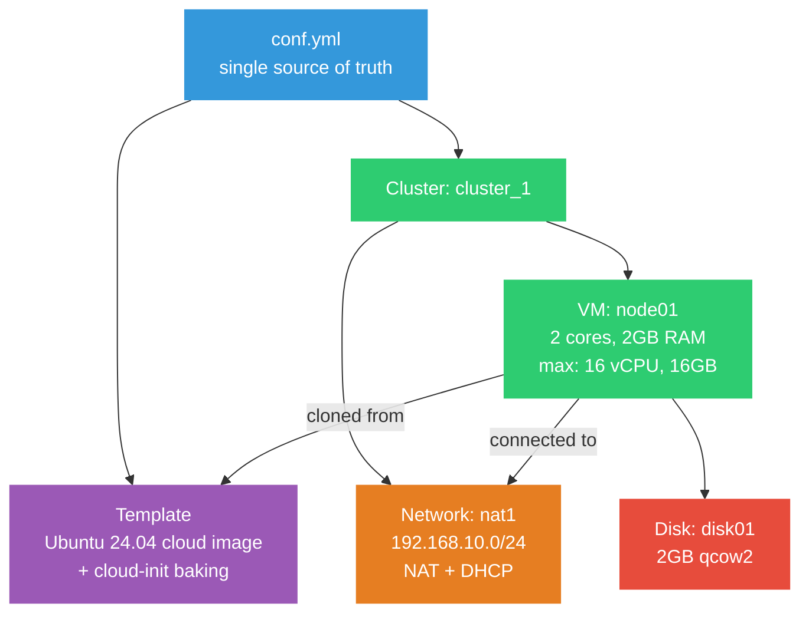
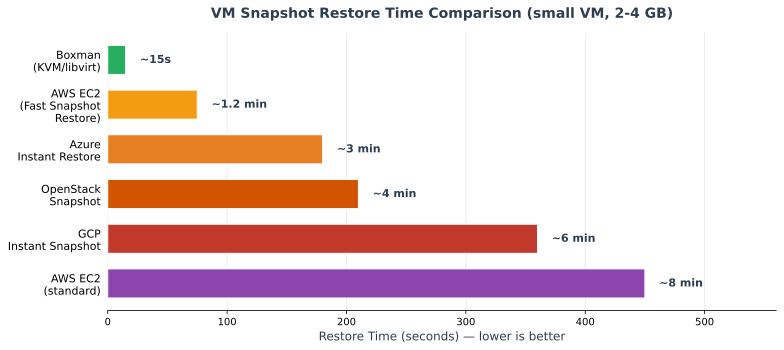
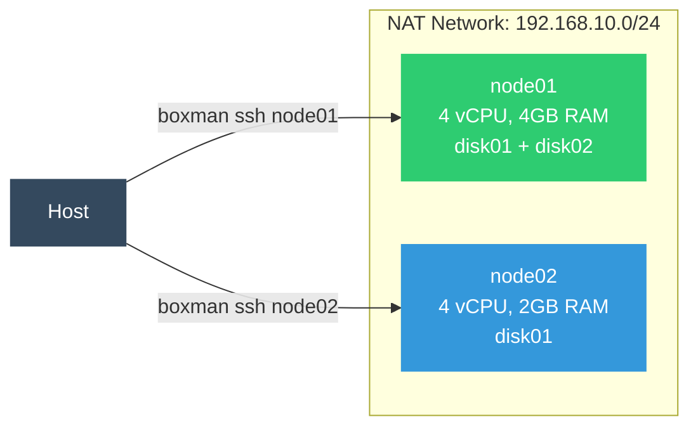
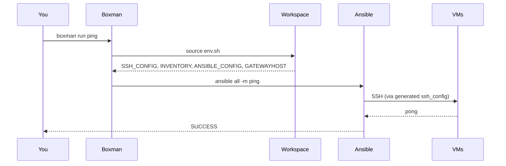
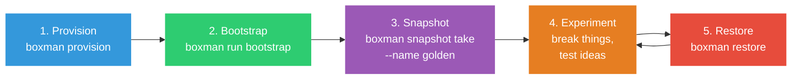

# Boxman Tutorial: Fast Local VM Development

> **Docker Compose for VMs** -- declarative local clusters on libvirt/KVM,
> with instant snapshots and live scaling.

**Audience:** Engineers who work with cloud infrastructure (AWS, OpenStack, GCP, Azure)
and want a fast, local alternative for development and testing.

**What you'll need:**
- A Linux machine with 8+ GB RAM and ~50 GB free disk (bare metal or cloud instance with nested virt)
- sudo access
- ~30 minutes

**What you'll get:**
- A fully declarative VM cluster from a single YAML file
- Instant snapshots and restore (seconds, not minutes)
- Live CPU/memory/disk scaling without VM downtime
- Ansible automation out of the box

---

## Table of Contents

- [Chapter 1: Your First VM -- Provision, Break, Restore](#chapter-1-your-first-vm----provision-break-restore)
- [Chapter 2: Scaling -- Add VMs, Disks, Live Changes](#chapter-2-scaling----add-vms-disks-live-changes)
- [Chapter 3: Ansible Automation & the Matrix](#chapter-3-ansible-automation--the-matrix)

---

# Chapter 1: Your First VM -- Provision, Break, Restore

## 1.1 Install Libvirt

Boxman uses libvirt/QEMU under the hood. Install the virtualization stack for your distro:

### Arch Linux

```bash
sudo pacman -S libvirt qemu-full virt-install sshpass dnsmasq
sudo systemctl enable --now libvirtd
sudo usermod -aG libvirt,kvm $USER
```

### Ubuntu / Debian

```bash
sudo apt update
sudo apt install -y \
  libvirt-daemon-system libvirt-clients qemu-kvm \
  virtinst sshpass bridge-utils cloud-image-utils
sudo systemctl enable --now libvirtd
sudo usermod -aG libvirt,kvm $USER
```

### Fedora / RHEL / Rocky

```bash
sudo dnf install -y libvirt qemu-kvm virt-install sshpass genisoimage
sudo systemctl enable --now libvirtd
sudo usermod -aG libvirt,kvm $USER
```

> **Important:** Log out and back in after adding yourself to the groups.

### Verify

```bash
virsh -c qemu:///system list
```

You should see an empty table. If it fails, check `systemctl status libvirtd`.

## 1.2 Install Boxman

```bash
python3 -m venv ~/boxman-env
source ~/boxman-env/bin/activate
pip install boxman
boxman --version
```

Or from source:

```bash
git clone https://github.com/mherkazandjian/boxman.git
cd boxman
pip install .
boxman --version
```

## 1.3 The Configuration File

Everything in Boxman is driven by a single YAML file. Here's what we'll use for Chapter 1
([conf/tutorial1.yml](conf/tutorial1.yml)):

```yaml
version: '1.0'
project: boxman_tutorial

provider:
  libvirt:
    uri: qemu:///system
    use_sudo: True
    ...

templates:
  ubuntu_base:
    name: ubuntu-24.04-tutorial-base
    image:
      uri: http://cloud-images-archive.ubuntu.com/releases/noble/...
      checksum: sha256:32a9d30d18803da72f5936cf2b7b...
    disk_size: 20G
    os_variant: ubuntu24.04
    cloudinit: |
      #cloud-config
      ...

workspace:
  path: ~/workspaces/boxman-tutorial

clusters:
  cluster_1:
    base_image: ubuntu-24.04-tutorial-base
    admin_user: admin
    admin_pass: {{ env("BOXMAN_ADMIN_PASS", default="boxman") }}

    networks:
      nat1:
        mode: nat
        ip:
          address: '192.168.10.1'
          netmask: '255.255.255.0'
          dhcp:
            range: { start: '192.168.10.2', end: '192.168.10.254' }

    vms:
      node01:
        hostname: node01
        cpus: { sockets: 1, cores: 2, threads: 2 }
        memory: 2048
        max_vcpus: 16       # ceiling for live hot-scaling later
        max_memory: 16384   # ceiling for live hot-scaling later
        disks:
          - name: disk01
            target: vdb
            size: 2048
        network_adapters:
          - name: adapter_1
            network_source: 'nat1'
```

### How the pieces fit together



**Key concepts:**

| Section | What it does |
|---|---|
| `templates` | Downloads a cloud image and bakes it with cloud-init (users, SSH, packages). This is a **one-time** operation -- the template is cached and reused. |
| `clusters` | Defines a group of VMs that share networks and SSH configuration. |
| `networks` | Libvirt virtual networks. `nat` mode gives VMs internet access via the host. |
| `vms` | Each VM is cloned from the template. `max_vcpus` and `max_memory` set the hot-scaling ceiling (we'll use this in Chapter 2). |
| `workspace` | Directory where boxman generates SSH configs, ansible inventory, and keys. |

## 1.4 Provision

```bash
cd doc/tutorial/conf
boxman --conf tutorial1.yml provision
```

Behind the scenes, boxman:

1. Renders Jinja2 templates in the YAML
2. Downloads the Ubuntu cloud image (cached after first run in `~/.cache/boxman/images/`)
3. Creates the template VM via cloud-init (installs packages, creates admin user)
4. Defines libvirt networks
5. Clones `node01` from the template
6. Starts the VM, waits for DHCP, injects SSH keys
7. Generates `ssh_config` and ansible inventory in the workspace

Verify it's running:

```bash
boxman --conf tutorial1.yml ps
```

```
Cluster    VM      State     IP
---------  ------  -------   --------------
cluster_1  node01  running   192.168.10.xxx
```

## 1.5 SSH In

```bash
boxman --conf tutorial1.yml ssh
```

You're now inside `node01`. Poke around:

```bash
uname -a        # Linux node01 6.x ...
nproc           # 4 (2 cores x 2 threads)
free -m         # ~2GB
lsblk           # vda (root), vdb (2GB extra disk)
ip addr         # 192.168.10.x on the NAT network
exit
```

## 1.6 Take a Snapshot

```bash
boxman --conf tutorial1.yml snapshot take --name "clean-state"
```

List it:

```bash
boxman --conf tutorial1.yml snapshot list
```

```
VM      Snapshot      Creation Time             State
------  -----------   ----------------------    --------
node01  clean-state   2025-01-15T14:23:45+00    shutoff
```

This captures the **entire VM state** -- disk, memory, running processes -- all of it.

## 1.7 Break It

SSH in and cause some damage:

```bash
boxman --conf tutorial1.yml ssh

# Inside the VM:
sudo rm -rf /usr/bin/python3 /etc/hostname /var/log/*
echo "everything is broken" | sudo tee /etc/motd
exit
```

Try SSH again -- things are visibly wrong:

```bash
boxman --conf tutorial1.yml ssh
# hostname is gone, python is missing, logs are wiped
cat /etc/motd   # "everything is broken"
exit
```

## 1.8 Restore

```bash
boxman --conf tutorial1.yml snapshot restore --name "clean-state"
```

Now SSH back in:

```bash
boxman --conf tutorial1.yml ssh

# Everything is back:
python3 --version    # works
cat /etc/hostname    # node01
ls /var/log/         # logs are back
cat /etc/motd        # original content
exit
```

**That took seconds.** Not minutes. Seconds.

## 1.9 How Does This Compare?

Here's how snapshot restore times compare across platforms for a small VM (2-4 GB disk):



| Platform | Typical Restore Time | Source |
|---|---|---|
| **Boxman (KVM/libvirt)** | **5 -- 30 seconds** | Local qcow2 COW, no network | 
| AWS EC2 (Fast Snapshot Restore) | 30s -- 2 minutes | [AWS Blog](https://aws.amazon.com/blogs/aws/new-amazon-ebs-fast-snapshot-restore-fsr/) |
| Azure Instant Restore | 1 -- 5 minutes | [Microsoft Learn](https://learn.microsoft.com/en-us/azure/backup/backup-instant-restore-capability) |
| OpenStack Snapshot | 2 -- 5 minutes | [CERN Cloud Guide](https://clouddocs.web.cern.ch/using_openstack/backups.html) |
| GCP Instant Snapshot | 2 -- 10 minutes | [Google Cloud Docs](https://docs.google.com/compute/docs/disks/create-instant-snapshots) |
| AWS EC2 (standard) | 5 -- 10+ minutes | [AWS Storage Blog](https://aws.amazon.com/blogs/storage/addressing-i-o-latency-when-restoring-amazon-ebs-volumes-from-ebs-snapshots/) |

**Why is boxman so fast?** KVM snapshots operate at the hypervisor level on local storage.
The qcow2 format uses copy-on-write -- a restore is essentially swapping a pointer back
to the snapshot's backing state. No network round-trips, no API overhead, no block-level
replication across availability zones.

---

# Chapter 2: Scaling -- Add VMs, Disks, Live Changes

In this chapter we'll scale the cluster **without reprovisioning** -- add a second VM, attach
a new disk, and hot-scale CPU and memory. The VMs stay up throughout.

We start from the same config as Chapter 1. The final scaled config is at
[conf/tutorial2-scaled.yml](conf/tutorial2-scaled.yml).

## 2.1 Add a Second VM

Edit your `tutorial1.yml` (or switch to `tutorial2-scaled.yml`) and add `node02` under `vms`:

```yaml
    vms:
      node01:
        # ... existing config unchanged ...

      node02:                 # <-- add this
        hostname: node02
        cpus:
          sockets: 1
          cores: 2
          threads: 2
        memory: 2048
        max_vcpus: 16
        max_memory: 16384
        disks:
          - name: disk01
            driver:
              name: qemu
              type: qcow2
            target: vdb
            size: 2048
        network_adapters:
          - name: adapter_1
            link_state: 'up'
            network_source: 'nat1'
```

Preview what will change:

```bash
boxman --conf tutorial2-scaled.yml update --dry-run
```

Apply:

```bash
boxman --conf tutorial2-scaled.yml update
```

Verify both VMs are running:

```bash
boxman --conf tutorial2-scaled.yml ps
```

```
Cluster    VM      State     IP
---------  ------  -------   --------------
cluster_1  node01  running   192.168.10.x
cluster_1  node02  running   192.168.10.y
```

`node01` **never stopped**. Boxman cloned a new VM from the template and added it alongside.



## 2.2 Add a Disk to node01

In the same config, add a second disk to `node01`:

```yaml
      node01:
        disks:
          - name: disk01
            driver: { name: qemu, type: qcow2 }
            target: vdb
            size: 2048
          - name: disk02          # <-- add this
            driver:
              name: qemu
              type: qcow2
            target: vdc
            size: 4096
```

```bash
boxman --conf tutorial2-scaled.yml update --dry-run
# Shows: node01: add disk disk02 (4096 MB)

boxman --conf tutorial2-scaled.yml update
```

Verify inside the VM:

```bash
boxman --conf tutorial2-scaled.yml ssh node01
lsblk
# NAME   MAJ:MIN RM  SIZE RO TYPE MOUNTPOINTS
# vda    252:0    0   20G  0 disk /
# vdb    252:16   0    2G  0 disk
# vdc    252:32   0    4G  0 disk   <-- new!
exit
```

The disk was hot-attached. No reboot.

## 2.3 Live CPU and Memory Scaling

This is where `max_vcpus` and `max_memory` pay off. Change `node01`'s resources:

```yaml
      node01:
        cpus:
          sockets: 1
          cores: 4          # was 2
          threads: 2
        memory: 4096         # was 2048
```

```bash
boxman --conf tutorial2-scaled.yml update
```

Verify -- the VM is still up:

```bash
boxman --conf tutorial2-scaled.yml ssh node01
nproc       # 8 (4 cores x 2 threads)
free -m     # ~4GB
uptime      # still counting from original boot
exit
```

**No reboot, no downtime.** Boxman uses `virsh setvcpus` and `virsh setmem` under the hood
for live hot-plug. This works because we set `max_vcpus: 16` and `max_memory: 16384` at
creation time -- the QEMU process was started with headroom for scaling.

## 2.4 Snapshot the Whole Cluster

```bash
boxman --conf tutorial2-scaled.yml snapshot take --name "cluster-good-state"
boxman --conf tutorial2-scaled.yml snapshot list
```

Both `node01` and `node02` are captured.

## 2.5 Build Something Worth Protecting

Let's put some real state in the VMs so the restore feels meaningful.

**On node01** -- start a web server:

```bash
boxman --conf tutorial2-scaled.yml ssh node01

mkdir -p /tmp/webapp
cat > /tmp/webapp/index.html << 'HTML'
<html>
<body style="font-family: monospace; padding: 2em; background: #1a1a2e; color: #0f0;">
  <h1>node01 is alive</h1>
  <p>Served from a Boxman-managed VM.</p>
  <p>If you can read this, the restore worked.</p>
</body>
</html>
HTML
nohup python3 -m http.server 8080 --directory /tmp/webapp > /dev/null 2>&1 &
curl -s localhost:8080 | head -3
exit
```

**On node02** -- create a database:

```bash
boxman --conf tutorial2-scaled.yml ssh node02

sudo apt install -y sqlite3
sqlite3 /tmp/mydata.db << 'SQL'
CREATE TABLE experiments (
    id INTEGER PRIMARY KEY,
    name TEXT,
    result TEXT,
    created_at TEXT DEFAULT (datetime('now'))
);
INSERT INTO experiments (name, result) VALUES ('baseline', 'PASS');
INSERT INTO experiments (name, result) VALUES ('stress-test', 'PASS');
INSERT INTO experiments (name, result) VALUES ('failover', 'PASS');
SQL
sqlite3 /tmp/mydata.db "SELECT * FROM experiments;"
exit
```

Now take a snapshot that captures all of this:

```bash
boxman --conf tutorial2-scaled.yml snapshot take --name "apps-running"
```

## 2.6 Nuke Everything, Restore Everything

Destroy both VMs from the inside:

```bash
# Terminal 1: nuke node01
boxman --conf tutorial2-scaled.yml ssh node01
sudo rm -rf /etc /usr /var /bin /sbin /tmp/webapp
# Connection drops -- the VM is wrecked

# Terminal 2: nuke node02
boxman --conf tutorial2-scaled.yml ssh node02
sudo rm -rf /etc /usr /var /bin /sbin /tmp/mydata.db
# Connection drops
```

Both VMs are now unrecoverable through normal means. Restore:

```bash
boxman --conf tutorial2-scaled.yml snapshot restore --name "apps-running"
```

Verify:

```bash
# Web server on node01
boxman --conf tutorial2-scaled.yml ssh node01
curl -s localhost:8080 | head -3
# <html> ... "node01 is alive" ... 
exit

# Database on node02
boxman --conf tutorial2-scaled.yml ssh node02
sqlite3 /tmp/mydata.db "SELECT * FROM experiments;"
# 1|baseline|PASS|...
# 2|stress-test|PASS|...
# 3|failover|PASS|...
exit
```

**Everything is back.** Web server, database, all data -- restored in seconds.

---

# Chapter 3: Ansible Automation & the Matrix

Boxman doesn't just provision VMs -- it generates a complete ansible workspace. In this
chapter we'll use it to bootstrap a cluster, deploy a live terminal demo, break it, and
resurrect it.

The full config for this chapter is at [conf/tutorial3.yml](conf/tutorial3.yml).

## 3.1 The Workspace

After provisioning, boxman auto-generates these files in your `workspace.path`:

```
~/workspaces/boxman-tutorial/
    env.sh                      # environment variables (INVENTORY, SSH_CONFIG, etc.)
    ssh_config                  # SSH config mapping hostnames to IPs + keys
    id_ed25519_boxman           # generated SSH key pair
    id_ed25519_boxman.pub
    ansible.cfg                 # pre-configured for this cluster
    inventory/
        01-hosts.yml            # auto-generated ansible inventory
```

You never have to write ansible inventory or SSH configs by hand. Boxman does it.

### Workspace Files

Chapter 3's config also uses `workspace.files` to provision ansible playbooks alongside
the infrastructure:

```yaml
workspace:
  path: ~/workspaces/boxman-tutorial

  files:
    ansible/bootstrap.yml: |
      ---
      - name: Bootstrap all nodes
        hosts: all
        become: true
        tasks:
          - name: Install base packages
            ansible.builtin.package:
              name: "{{ item }}"
              state: present
            loop: [vim, tmux, htop, tree, curl, cmatrix]

    ansible/cmatrix-start.yml: |
      ---
      - name: Start cmatrix in tmux on all nodes
        hosts: all
        become: true
        tasks:
          - name: Start cmatrix in a tmux session
            ansible.builtin.shell: |
              tmux kill-session -t matrix 2>/dev/null || true
              tmux new-session -d -s matrix 'cmatrix -b -u 4'
```

### Tasks

The config also defines named tasks -- shortcuts for common commands:

```yaml
tasks:
  ping:
    description: "ping all hosts"
    command: ansible all {{ flags }} -m ansible.builtin.ping

  cmd:
    description: "run a shell command on all hosts"
    command: ansible all {{ flags }} -m ansible.builtin.shell -a

  bootstrap:
    description: "install base packages and cmatrix"
    command: ansible-playbook {{ flags }} --become ansible/bootstrap.yml

  cmatrix-start:
    description: "start the Matrix in tmux on all nodes"
    command: ansible-playbook {{ flags }} --become ansible/cmatrix-start.yml
```

### How `boxman run` works



## 3.2 Provision with Chapter 3 Config

If you're continuing from Chapter 2, deprovision first:

```bash
boxman --conf tutorial2-scaled.yml deprovision --cleanup
```

Then provision with the Chapter 3 config:

```bash
boxman --conf tutorial3.yml provision
```

## 3.3 Running Commands

List available tasks:

```bash
boxman --conf tutorial3.yml run --list
```

```
Task             Description
---------------  -----------------------------------------------
ping             ping all hosts via ansible
cmd              run a shell command on all hosts
bootstrap        install base packages and cmatrix on all nodes
cmatrix-start    start cmatrix in tmux on all nodes
cmatrix-stop     stop cmatrix on all nodes
```

Run them:

```bash
# Ping all hosts
boxman --conf tutorial3.yml run ping

# Run a command on all hosts
boxman --conf tutorial3.yml run cmd -- hostname
boxman --conf tutorial3.yml run cmd -- uptime

# Limit to a single host
boxman --conf tutorial3.yml run cmd -- --limit node01 free -m
```

## 3.4 Bootstrap the Cluster

Install packages (including cmatrix) on all nodes:

```bash
boxman --conf tutorial3.yml run bootstrap
```

This runs the `ansible/bootstrap.yml` playbook, which installs `vim`, `tmux`, `htop`,
`tree`, `curl`, and `cmatrix` on every VM in the cluster.

## 3.5 The Matrix Demo

This is the moment. We'll start the Matrix rain on all VMs, take a live snapshot,
destroy everything, and watch the Matrix resurrect.

### Step 1: Start the Matrix

```bash
boxman --conf tutorial3.yml run cmatrix-start
```

SSH into a node and attach to the tmux session to see it:

```bash
boxman --conf tutorial3.yml ssh node01
tmux attach -t matrix
```

You should see green characters cascading down the terminal -- the Matrix is running.

Detach from tmux with `Ctrl-b d`, then `exit` the SSH session.

### Step 2: Take a Live Snapshot

The `--live` flag captures the VM state **including running processes and memory**:

```bash
boxman --conf tutorial3.yml snapshot take --live --name "matrix-running"
```

The Matrix is still running inside the VMs while the snapshot is taken.

### Step 3: Destroy Everything

Open a separate terminal and nuke node01:

```bash
boxman --conf tutorial3.yml ssh node01
sudo rm -rf /usr /bin /etc /var /sbin
# Connection drops. The Matrix is dead.
```

Do the same to node02:

```bash
boxman --conf tutorial3.yml ssh node02
sudo rm -rf /usr /bin /etc /var /sbin
# Connection drops.
```

Both VMs are completely destroyed. No SSH, no processes, nothing.

### Step 4: Restore

```bash
boxman --conf tutorial3.yml snapshot restore --name "matrix-running"
```

### Step 5: The Matrix Lives

SSH back into node01 and reattach to the tmux session:

```bash
boxman --conf tutorial3.yml ssh node01
tmux attach -t matrix
```

**The Matrix rain is still falling.** The process was captured in the live snapshot and
resumed exactly where it was. Not restarted -- *resumed*.

This is what a live snapshot restore looks like: the VM's entire state -- disk, memory,
running processes -- is rewound to the exact moment the snapshot was taken.

## 3.6 The Auto-Bootstrap Pattern

Here's the workflow that makes Boxman shine for daily development:



```bash
# One-time setup
boxman --conf tutorial3.yml provision
boxman --conf tutorial3.yml run bootstrap
boxman --conf tutorial3.yml snapshot take --name "golden"

# Daily workflow
#   ... experiment, break things, test ideas ...
boxman --conf tutorial3.yml restore    # back to golden in seconds
#   ... experiment again ...
```

Your entire dev environment is:
- **Defined** in a single YAML file
- **Provisioned** with one command
- **Restorable** in seconds
- **Version-controlled** alongside your code

---

## Cleanup

When you're done with the tutorial:

```bash
boxman --conf tutorial3.yml deprovision --cleanup
```

This removes all VMs, networks, SSH keys, and generated workspace files.

---

## Quick Reference

| Command | What it does |
|---|---|
| `boxman provision` | Create everything from conf.yml |
| `boxman ps` | Show VM status |
| `boxman ssh [vm]` | SSH into a VM |
| `boxman update` | Apply config changes (add VMs, disks, scale CPU/RAM) |
| `boxman update --dry-run` | Preview what would change |
| `boxman snapshot take --name X` | Capture VM state |
| `boxman snapshot take --live` | Capture without stopping VMs |
| `boxman snapshot list` | List all snapshots |
| `boxman snapshot restore --name X` | Restore to a named snapshot |
| `boxman restore` | Restore to the latest snapshot |
| `boxman run --list` | List available tasks |
| `boxman run <task> [-- args]` | Run a named task |
| `boxman deprovision --cleanup` | Tear everything down |

All commands accept `--conf <file>` to specify the config file (defaults to `conf.yml` in the current directory).
